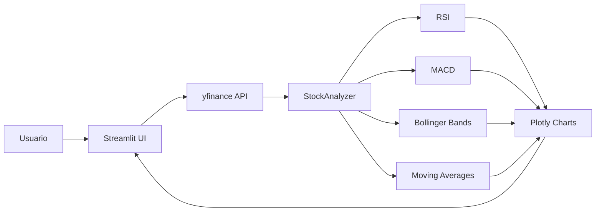
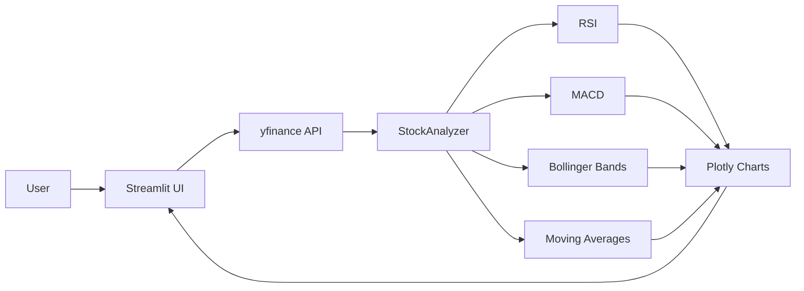

# Real-Time Stock Analytics

[](https://www.python.org/)
[](https://streamlit.io/)
[](https://plotly.com/)
[](https://pypi.org/project/yfinance/)
[](LICENSE)

[Portugues](#portugues) | [English](#english)

---

## Portugues

### Visao Geral

Dashboard Streamlit para analise de acoes (`app.py`, ~317 linhas). Busca dados via yfinance, calcula indicadores tecnicos e exibe graficos interativos Plotly.

**Funcionalidades:**

- Busca de dados de acoes em tempo real via yfinance
- Indicadores tecnicos: RSI, MACD, Medias Moveis (MA20/MA50), Bandas de Bollinger
- Graficos interativos Plotly (candlestick, volume, indicadores)
- Interface web em tempo real com Streamlit

### Arquitetura



### Como Executar

```bash
# Clonar o repositorio
git clone https://github.com/galafis/Real-Time-Stock-Analytics.git
cd Real-Time-Stock-Analytics

# Criar ambiente virtual
python -m venv venv
source venv/bin/activate  # Windows: venv\Scripts\activate

# Instalar dependencias
pip install -r requirements.txt

# Executar
streamlit run app.py
```

### Estrutura do Projeto

```
Real-Time-Stock-Analytics/
├── tests/
│   └── test_app.py
├── LICENSE
├── README.md
├── app.py
└── requirements.txt
```

### Autor

**Gabriel Demetrios Lafis**
- GitHub: [@galafis](https://github.com/galafis)
- LinkedIn: [Gabriel Demetrios Lafis](https://linkedin.com/in/gabriel-demetrios-lafis)

### Licenca

Este projeto esta licenciado sob a Licenca MIT - veja o arquivo [LICENSE](LICENSE) para detalhes.

---

## English

### Overview

Streamlit dashboard for stock analysis (`app.py`, ~317 lines). Fetches data via yfinance, calculates technical indicators, and displays interactive Plotly charts.

**Features:**

- Real-time stock data fetching via yfinance
- Technical indicators: RSI, MACD, Moving Averages (MA20/MA50), Bollinger Bands
- Interactive Plotly charts (candlestick, volume, indicators)
- Real-time web interface with Streamlit

### Architecture



### Quick Start

```bash
# Clone the repository
git clone https://github.com/galafis/Real-Time-Stock-Analytics.git
cd Real-Time-Stock-Analytics

# Create virtual environment
python -m venv venv
source venv/bin/activate  # Windows: venv\Scripts\activate

# Install dependencies
pip install -r requirements.txt

# Run
streamlit run app.py
```

### Project Structure

```
Real-Time-Stock-Analytics/
├── tests/
│   └── test_app.py
├── LICENSE
├── README.md
├── app.py
└── requirements.txt
```

### Author

**Gabriel Demetrios Lafis**
- GitHub: [@galafis](https://github.com/galafis)
- LinkedIn: [Gabriel Demetrios Lafis](https://linkedin.com/in/gabriel-demetrios-lafis)

### License

This project is licensed under the MIT License - see the [LICENSE](LICENSE) file for details.
